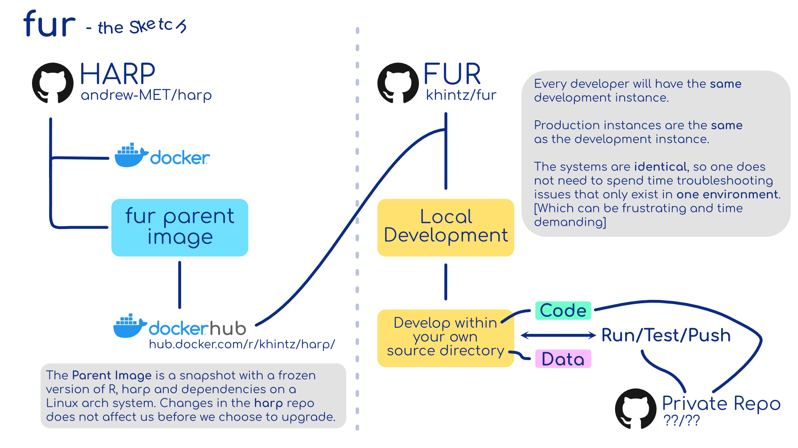

# FUR
FU-NWP DMI container environment for development using R and HARP.\
For HARP references see: https://github.com/andrew-MET/harp

# Install
First install the parent image. This image is precompiled with R and HARP with all the dependencies. From the parent image we build a new image which is used to run our source code in. To get the parent image do:

**1. `docker pull khintz/harp:testing`**\
If interested the code for building the parent image is in the directory `image_src`.

Within the `fur` directory do:\
**2. `bash deploy.sh`**

This will build your local image and run the container afterwards. You can use this to run everything even when your source code has changed. It wont rebuild unless necessary. *The first time this runs it have to download the parent image.* If you change source code, make sure to build the image before running the container. Using the `deploy.sh` script is the safe way to be sure of this.

When running the deploy script, `deploy.sh`, it will copy all the code within `src` and run the `main.R` script as `Rscript main.R`.
From here the development and funny things starts.

*deploy.sh* does in principle just run the following two Docker commands:\
**`docker build -t image_name .`**\
**`docker run -d --name container_name image_name`**

## Run your container:
**docker run -dit --name NameForContainer -v $FURHOME/container-data:/data image_name**\
or\
**bash run_container.sh**

The `-v` argument binds a local data directory (`$FURHOME/container-data`) to the container. The container then access the data in `/data`. We recommend to not change the directory name in the container but the local directory can be whatever.

If you change your source code, make sure to build your image again.

# Data Example
The `container-data/carra` directory have example vfld files. By default these are used by the **main.R** script when running the container. In practice one would define your own data directory and do what you want to do with it. The data is *not* copied into the container but linked via a read/write layer between the host and the container.

# Troubleshooting
If for some reason the image fails to build and returns a 404 error code, then add "--no-cache" to the Docker build file in deploy.sh. This forces the image to be build from scratch.

# Overview



# "Help me! I am new to docker"-section
Get a list of all containers:
```
docker container ls -a
```
To remove a container
```
docker container rm CONTAINERID
```
To remove all stopped containers
```
docker rm $(docker ps --filter=status=exited --filter=status=created -q)
```

To get a list of all images
```
docker images
```
To remove an image
```
docker image rm IMAGEID
```
Dangling images can be removed with
```
docker rmi $(docker images -a --filter=dangling=true -q)
```
Remove all dangling images
```
docker image prune -a
```
Brute force clean images
```
docker rmi $(docker images -a)
```
